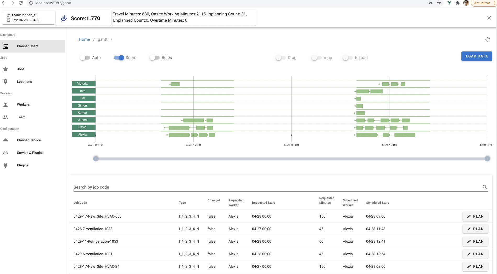

# easydispatch

This is a real time field service dispatching planner. It automatically dispatch jobs to different workers under business restrictions like working hour, skills, etc. 

Some of the key feature highlights:
- Real Time Dispatching based on three types of Dispatching Algorithms: Heuristic, Optimization, Reinforcement Learning
- Vehicle Routing Problem capability embedded
- Flexible Business Rule Plugins, specifies what solution is allowed but not how to reach a solution
- Explainable AI to do drag and drop what-if analysis.
- Full set of REST API and API Documents

Register a free account at the hosted [demo site](https://dispatch.easydispatch.uk/login), or check out  [the website](https://www1.easydispatch.uk/) for more information.




## Quick Start
EasyDispatch relies on Postgres DB, Redis and Kafka. Those three components can be started by [docker](https://docs.docker.com/engine/install/ubuntu/) and [compose](https://docs.docker.com/compose/install/) or provisioned seperately. You also should have [npm and node](https://docs.npmjs.com/downloading-and-installing-node-js-and-npm) for frontend development.

1. To run easydispatch locally, first install it by:
```bash
git clone https://github.com/alibaba/easydispatch.git && cd easydispatch
pip install -e .
```

2. Then copy and modify env file from $easydisaptch/etc/dev_env_sample to $easydisaptch/dev.env  . Start the database, redis and kafka by docker composer.

```bash
docker-compose -f kafka-redis-postgres-compose.yml -p easy up
```

3. Open another terminal, populate some sample data and run the frontend:

```bash
python -m dispatch.cli database init
python -m dispatch.cli server start --port 8000 dispatch.main:app 
```

4. Visit the page at : http://localhost:8000/login


## Usage

Those scripts can be used for testing purpose:
- clear off all existing workers and jobs
- generate sample data for a period
- use batch optimizer to dispatch all jobs in the planning window

```bash
cd $EASHDISPATCH_HOME
python  tests/kandbox_clear_data.py 
python -m dispatch.cli util generate --dataset veo --team_code london_t1 --start_day 20210503 --end_day 20210505 --username demo --password demo
python -m dispatch.cli job dispatch  --team_code london_t1  --start_day 20210503 --dispatch_days 2

```

### OS and Environements
We have tested it on Ubuntu 20.04 and MacOS, Python 3.7 / 3.8 / 3.9


# Reference
The frontend and server technology stack (vue + python) were adapted from [Netflix Dispatch](https://github.com/Netflix/dispatch). Data structures are not compatible.


